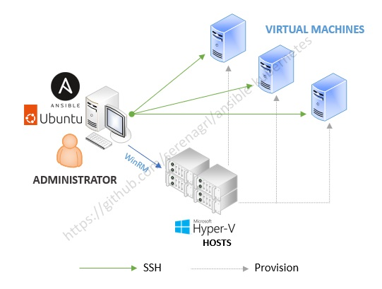

# Kubernetes on Hyper-V
A collection of Ansible playbooks and roles to create a Kubernetes cluster on Hyper-V, either for testing/learning purposes or SIT/Proof-of-Concept environments. These playbooks and add-ons were tailored to my lab environment and were not intended to be an all-purpose "installer" for Kubernetes. Therefore, please feel free to customize them as you see fit.

## Quick Notes
* Knowledge of [Ansible](https://www.ansible.com/) is required to work with the playbooks.
* Playbooks are tested on **Windows 11** and **Windows Server 2022** Hyper-V hosts.
* Playbooks can provision VMs for **Ubuntu 22.04/24.04** or **Red Hat 9.3** Linux.
* Playbooks default to setup a DNS, 2 HAProxy load balancers and 3 control-plane VMs.
* The Kubernetes cluster uses **Containerd** as container runtime and **Calico** as CNI.
* Configure everything in the [`/inventories`](inventories) folder and [`roles/vm-linux/setup-vm/vars/main.yaml`](roles/vm-linux/setup-vm/vars/main.yaml).

## Hyper-V Host Requirements

A Windows machine or server with sufficient processing power, RAM and disk space (i7 CPU, 128GB RAM, SSD recommended) with:
* Hyper-V feature enabled.
* [Windows Subsystem for Linux (WSL)](https://learn.microsoft.com/en-us/windows/wsl/install) installed.
* Ubuntu 22.04 or 24.04 distribution installed in WSL.

> [!NOTE]
> Edit the `/etc/wsl.conf` file to configure Ubuntu WSL to always login as root user.
> ```ini
> [boot]
> systemd=true
>
> [user]
> default=root
> ```
> You need to reload the terminal for the changes to take effect.

Prepare two folders in the Windows Hyper-V host:
* A folder to store temporary seed iso images i.e. `"D:\Installation Files"`
* A folder where the Virtual Machines will be created in i.e. `"D:\Virtual Machines"`

> [!CAUTION]
> You can set both to point to the same folder but there can be residue seed iso images leftover from provisioning errors. In such cases, you will need to manually clean them up.

### Multiple Hyper-V Hosts Considerations

Generally, you setup everything on a single host or PC if there are enough computing resources. However, you can also configure the Hyper-V host to be on another machine or pool multiple Windows Hyper-V hosts together to distribute the load of hosting the VMs but make sure each Hyper-V host is configured correctly (WinRM and shared folders). The diagram below illustrates the topology.

<p align="center">
  
</p>

### Virtual Machine Requirements

The required computing resources for each VM is dependent on the number of add-ons you are planning to install and how much capacity your Windows host can provide. By default, the VMs created are using **Dynamic Memory**. You can change this behavior in **Hyper-V Manager** to prevent the VMs from exceeding the assigned memory limits.

> [!CAUTION]
> VM _Checkpoints_ are created to provide recovery in case of installation failures. **These checkpoints consume additional disk space**. Please perform the necessary housekeeping manually to reclaim the disk space or disable checkpoint creation by setting `vm_checkpoint: no` in the [`inventories/group_vars/all.yaml`](inventories/group_vars/all.yaml) inventory file.

#### INFRASTRUCTURE SERVICES VMs

There are 3 VMs that are _optional_ to support the Kubernetes Cluster and these are categorized as **Infrastructure Services**. These VMs need to be provisioned and configured first, before setting up the Kubernetes Cluster (if you choose to include them). The Load-Balancers will each have their own VM and a separate VM is dedicated to host DNS, NFS and Minio.

> [!CAUTION]
> The Infrastructure Services VMs are purely meant to _simulate_ existing infrastructure in a real-world network topology. While you can use them as starting points to configure a production environment, **do not target them to existing production servers** that are already running. **Doing so will corrupt the existing servers.**

Recommendations for **Infrastructure Services** VMs are as follows:

| Services                           | Unit | vCPU | Min. RAM  | RAM | Disk  |
| ---------------------------------- | :--: | :--: | :-------: | :-: | :--:  |
| Load-Balancers                     | 2    | 2    | 1GB       | 1GB | 127GB |
| Infra Services (DNS)               | 1    | 2    | 1GB       | 1GB | 127GB |
| Infra Services (DNS + NFS)         | 1    | 2    | 2GB       | 2GB | 127GB |
| Infra Services (DNS + NFS + Minio) | 1    | 4    | 4GB       | 8GB | 256GB |

> [!WARNING]
> By default, **the Infrastructure Services VM will only be created during the provisioning of DNS**. NFS and Minio will not provision their own VMs by default. Configure the `provision_vm` variable for each DNS, NFS and Minio to change this behavior.

#### KUBERNETES CLUSTER VMs

The **Kubernetes Cluster** requires a minimum of 3 VMs for the control planes. Worker nodes are _optional_ - you can determine the number and size of worker nodes base on your needs.

Recommendations for **Kubernetes Cluster** VMs are as follows:

| Lab Type                    | Control Plane | vCPU | Min. RAM  | RAM  | Worker Node | vCPU | Min. RAM  | RAM  |
| --------------------------- | :-----------: | :--: | :-------: | :--: | :---------: | :--: | :-------: | :--: |
| Barebones Cluster           | 3             | 4    | 4GB       | 6GB  | Optional    | 4    | 4GB       | 4GB  |
| Basic (NFS)                 | 3             | 4    | 8GB       | 12GB | Optional    | 4    | 4GB       | 4GB  |
| Basic (Longhorn/Rook-ceph)  | 3             | 6    | 12GB      | 16GB | Optional    | 4    | 4GB       | 4GB  |
| DevOps/DevSecOps            | 3             | 6    | 16GB      | 24GB | Optional    | 4    | 4GB       | 4GB  |
| Observablity                | 3             | 6    | 16GB      | 24GB | Optional    | 4    | 4GB       | 4GB  |
| Test/SIT Environment        | 3             | 8    | 24GB      | 32GB | 2 (or more) | 4    | 4GB       | 8GB  |

> [!WARNING]
> Both **Longhorn** and **Rook-Ceph** CSIs can consume a lot of resources but offers a good learning path and discipline for managing clustered storage. You may need to utilize more than 1 Hyper-V hosts with more RAM if you have insufficient computing resources.

#### Disk Size

The recommendation for **disk size** is the VM default of **127GB** but when using CSIs such as Longhorn or Rook-ceph, it is recommended to set the disk size to **256GB** to support the pod request limits.

## Setting Up the Environment

It is recommended that you download and install [Visual Studio Code](https://code.visualstudio.com/) and enable the [Ansible VS Code Extension by Red Hat](https://marketplace.visualstudio.com/items?itemName=redhat.ansible) from the marketplace to work with the playbooks.

### 1. Install Ansible

Open a terminal **(with root access)** in the Ubuntu OS of the WSL and execute the following command to install Ansible:
```bash
apt update
apt install software-properties-common python3-pip
pip install ansible jmespath
```
Refer [here](https://docs.ansible.com/ansible/latest/installation_guide/intro_installation.html#pip-install) for more details.

> [!TIP]
> For Ubuntu 24.04, add the `--break-system-packages` option to the `pip` commands.

### 2. Configure Windows Remote Management (WinRM) on Windows Host

Open an Ubuntu terminal **(with root access)** in the WSL and run the following to install the pre-requisites:
```bash
pip install pywinrm
```

Create a **Windows user** with Administrator (or proper) priviledges for ansible in the Windows Hyper-V host. You can use the sample script below in a Powershell command prompt with _Administrator rights_ to create the `ansible` user but please change the password accordingly.
```powershell
$username = "ansible"
$password = ConvertTo-SecureString "p@ssw0rd" -AsPlainText -Force

New-LocalUser -Name $username -Password $password -FullName $username -Description "Ansible Controller Host Account" -AccountNeverExpires -PasswordNeverExpires -UserMayNotChangePassword

Add-LocalGroupMember -Group Administrators -Member $username
```

Run the configuration script provided by ansible to configure WinRM in the same powershell terminal:
```powershell
$setupscript = "https://raw.githubusercontent.com/ansible/ansible-documentation/ae8772176a5c645655c91328e93196bcf741732d/examples/scripts/ConfigureRemotingForAnsible.ps1"
Invoke-WebRequest $setupscript -OutFile winrm-setup.ps1
.\winrm-setup.ps1
```
Refer [here](https://docs.ansible.com/ansible/latest/os_guide/windows_setup.html) for more details.

### 3. Configure WinRM Settings in Playbooks

**Clone this repository** to a directory in the Ubuntu OS inside the WSL. Configure the necessary access rights to the directory if required.

```bash
git clone https://github.com/serenagrl/ansible-kubernetes.git
```

In the [`/inventories/winrm.yaml`](inventories/winrm.yaml) file, set the WinRM host IP address and the credentials that was created earlier.
```yaml
winrm:
  hosts:
    local_machine:
      ansible_host: 192.168.0.118      # IP Address of your WinRM (Hyper-V) host
      ansible_user: ansible            # Create a user in your Windows
      ansible_password: p@ssw0rd       # Provide the password for the user
      ansible_become_method: runas
      ansible_become_user: ansible     # Must set this to the user you created
      ansible_connection: winrm
      ansible_port: 5986
      ansible_winrm_transport: ntlm
      ansible_winrm_server_cert_validation: ignore
```

Refer [here](https://docs.ansible.com/ansible/latest/os_guide/windows_winrm.html) for detail documentation.

> [!IMPORTANT]
> Although optional, it is strongly recommended to use certificates to connect to WinRM. Please see [Configure WinRM to use Certificates](docs/configure-winrm-certs.md) for more details to apply this practice.

> [!NOTE]
> If you have more than 1 Hyper-V host, duplicate the `local_machine` host section for each host and rename it, and then configure the WinRM connection settings for that host. You can then manually specify the `winrm_host` for each of the VM host in the host files i.e. [`inventories/kubernetes_control_planes.yaml`](inventories/kubernetes_control_planes.yaml).

### 4. Test WinRM Connectivity

Run the [`test-winrm-connection.yaml`](test-winrm-connection.yaml) playbook to verify the WinRM connection.
```bash
ansible-playbook test-winrm-connection.yaml
```

You should get something similar to the following results if successful:
```bash
PLAY [Test WinRM Connection] *******************************************************************************************

TASK [Sending echo to WinRM host] **************************************************************************************
Wednesday 26 June 2024  17:17:22 +0800 (0:00:00.013)       0:00:00.013 ********
changed: [local_machine]

PLAY RECAP *************************************************************************************************************
local_machine              : ok=1    changed=1    unreachable=0    failed=0    skipped=0    rescued=0    ignored=0
```

> [!CAUTION]
>  WinRM setup is crucial. Please make sure it is configured properly before running the playbooks.

## Configuring the Playbooks

All basic/startup configurable items for the Infrastructure Services and Kubernetes Cluster are in the inventory files located in the [`/inventories`](inventories) folder. It is recommended to review all the inventory files and make the necessary changes for your lab environment.

### 1. Configuring Inventory Settings

Configure the settings for the Kubernetes Cluster in the [`inventories/group_vars/all.yaml`](inventories/group_vars/all.yaml) file. Configure the `lab_name` to allow the playbooks to use it as a prefix when auto-generating names for the hosts and VMs for the Infrastructure Services and Kubernetes Cluster. The playbooks will also organize the physical VMs inside a folder based on the `lab_name` for ease of management.

```yaml
# Will be used as the prefix for all the hostnames
lab_name: devops
```

The **VM specifications** can be configured in the remaining group variable files in the [`/inventories/group_vars`](inventories/group_vars) folder. Below is an example of the VM settings in the [`inventories/group_vars/kubernetes_control_planes.yaml`](inventories/group_vars/kubernetes_control_planes.yaml) file for the Kubernetes control-planes. **Please review the other files as well**.
```yaml
vm:
  specs:
    ram_size: 16GB
    min_ram_size: 12GB
    disk_size: 127GB
    v_cpu: 6
```

The **IP addresses** of the VMs can be configured in the host inventory files located in the [`/inventories`](inventories) folder. Below is an example of the [`inventories/kubernetes_control_planes.yaml`](inventories/kubernetes_control_planes.yaml) file for the Kubernetes control-planes. **You should review and change all the other host inventory files accordingly**.
```yaml
kubernetes_control_planes:
  hosts:
    control-plane-01:
      ansible_hostname: "{{ lab_name }}-cp1"
      ansible_host: 192.168.0.204

    control-plane-02:
      ansible_hostname: "{{ lab_name }}-cp2"
      ansible_host: 192.168.0.205

    control-plane-03:
      ansible_hostname: "{{ lab_name }}-cp3"
      ansible_host: 192.168.0.206
```
> [!TIP]
> If you do not want the hostnames to be auto-generated, you can manually hard-code them in `ansible_hostname`.

### 2. Configuring Common VM Settings

Common VM settings are configured in the [`roles/vm-linux/setup-vm/vars/main.yaml`](roles/vm-linux/setup-vm/vars/main.yaml) file and are applied to all VMs.

Configure the **network settings** for the VMs:
```yaml
vm:
  network:
    # The ipv4 of the gateway.
    gateway: 192.168.0.1
    cidr: 24
    dns: [ 8.8.8.8, 1.1.1.1 ]

  # The hyper-v switch to use
  switch: LAN
```

Specify the two folders that was created earlier:
```yaml
vm:
  # The location where the seed isos will be placed
  iso_folder: "D:\\Installation Files"

  # The location where the VMs will be created
  vm_folder: "D:\\Virtual Machines\\Kubernetes"
```

Configure the desired OS for the VMs. Current supported OS are `ubuntu` (default) or `redhat`.

For `ubuntu`, specify the url to the cloud image and the playbooks will automatically download it:
```yaml
vm:
  ubuntu:
    # The url to download the ubuntu cloud image file. You may need to change this when new release is available.
    img_url: https://cloud-images.ubuntu.com/releases/22.04/release/ubuntu-22.04-server-cloudimg-amd64.img
```

> [!NOTE]
> Sometimes the download may take longer due to designated mirrors or connectivity issues. In such cases, manually download the cloud image file, rename it to `ubuntu-cloud.img` and copy it into the location specified in `temp_dir` (i.e. `/var/automate`) in the Ubuntu WSL.

For `redhat`:
* Please download the **Red Hat Enterprise Linux KVM Guest Image** and specify it in `vm.redhat.kvm_image`.
* Specify the Red Hat Subscription username and password for automatic registration of the VMs to enable the dnf repositories.

```yaml
vm:
  os: redhat

  # RHEL images cannot be downloaded without signing in. Therefore, you will need to manually
  # download it and place it somewhere.
  redhat:
    # The full path and name to the RHEL KVM image to use.
    kvm_image: "/mnt/c/Installation Files/RedHat/rhel-9.3-x86_64-kvm.qcow2"

    # Your redhat login id
    username: <username>

    # Your redhat login password
    password: <password>
```

## Running the Playbooks

The playbooks can be run with the `ansible-playbook` command. i.e.
```bash
ansible-playbook setup-load-balancers.yaml
```
> [!TIP]
> This project can support [Semaphore UI](https://github.com/semaphoreui/semaphore), please refer to [Configure Semaphore UI (Experimental)](docs/configure-semaphore.md) for installation instructions.

To setup any **(Optional) Infrastructure Services**, run the following playbooks in sequence:

| No. | Name                        | Description                                                 | Remarks |
|  :-:| ----------------------------| ----------------------------------------------------------- | ------- |
|  1. | [`setup-dns.yaml`](setup-dns.yaml)            | Provision and configure a VM for BIND (DNS) server.         | **WARNING! Do not set host to existing DNS server!** <br>Set `kube.cluster.use_dns_server:` to `yes` or `no` in [`inventories/group_vars/all.yaml`](inventories/group_vars/all.yaml) accordingly. |
|  2. | [`setup-load-balancers.yaml`](setup-load-balancers.yaml) | Provision and configure two VMs for HAProxy and Keepalived. | When deploying load-balancers:<br><ul><li>Set `register_to_load_balancer: yes` in [`inventories/group_vars/kubernetes_cluster.yaml`](inventories/group_vars/kubernetes_cluster.yaml). </li><li>Set `kube.cluster.address` to the desired **virtual ip address** in [`inventories/group_vars/all.yaml`](inventories/group_vars/all.yaml). </li></ul>When not deploying load-balancers:<ul><li>Set `register_to_load_balancer: no` in [`inventories/group_vars/kubernetes_cluster.yaml`](inventories/group_vars/kubernetes_cluster.yaml). </li><li>Set `kube.cluster.address` to point to the **ip address of primary control plane** in [`inventories/group_vars/all.yaml`](inventories/group_vars/all.yaml).</li></ul> |
|  3. | [`setup-nfs.yaml`](setup-nfs.yaml)            | Install NFS server on infrastructure service VM.            | Run this if you plan to use CSI NFS. Note: You must run this **before** running the csi/nfs role. This does not provision the VM by default. |
|  4. | [`setup-minio.yaml`](setup-minio.yaml)          | Install Minio on infrastructure service VM.                 | Run this if you plan to test add-ons that requires external S3 storage for backups i.e. **velero** or **csi/longhorn**.  This does not provision the VM by default. |
|  5. | [`setup-vault.yaml`](setup-vault.yaml)          | Install Vault on infrastructure service VM.                 | Run this if you plan to auto unseal Vault with Transit secrets engine. Note: You must run this **before** running the vault role.  This does not provision the VM by default. |

To setup the **Kubernetes Cluster**, run the following playbooks in sequence:

| No. | Name                               | Description                                                         | Remarks |
|  :-:| ---------------------------------- | ------------------------------------------------------------------- | ------- |
|  1. | [`setup-control-plane-servers.yaml`](setup-control-plane-servers.yaml) | Provision VMs for kubernetes control planes. |-|
|  2. | [`setup-control-plane-primary.yaml`](setup-control-plane-primary.yaml) | Create the primary control plane in the kubernetes cluster. |-|
|  3. | [`setup-control-plane-other.yaml`](setup-control-plane-other.yaml)   | Create and join secondary control planes to the kubernetes cluster. |-|
|  4. | [`setup-worker-node-servers.yaml`](setup-worker-node-servers.yaml)   | Provisions VMs for the kubernetes worker nodes. | Run this to create worker nodes. |
|  5. | [`setup-worker-nodes.yaml`](setup-worker-nodes.yaml)          | Create and join worker nodes into the kubernetes cluster. | Run this to create worker nodes. |
|  6. | [`setup-add-ons.yaml`](setup-add-ons.yaml)               | Install add-on components listed in `add_ons`. | See [Installing and Configuring Add-ons](#installing-and-configuring-add-ons). |

## Installing and Configuring Add-ons

The [`setup-add-ons.yaml`](setup-add-ons.yaml) playbook is used to install and configure the add-on stack for the Kubernetes Cluster. It can be executed multiple times to install different add-ons. Each add-on is modularized into ansible roles and you can specify which one to install by listing them in the `add_ons:` collection.

The roles folders are structured in the following manner:

| Folder         | Description |
| -------------- |----         |
| defaults       | Default values that you should not change for the role. |
| tasks          | The tasks that performs the installation and configuration work. |
| vars           | Variable values that you can change to customize the role. |
| templates      | The jinja2 templates that you can modify to add extra configurations. |
| meta           | Role dependencies that you should not touch. |

Below is an example of installing some basic add-ons with csi/longhorn as the storage technology:
```yaml
- name: Install Kubernetes add-ons
  hosts: kubernetes_control_planes[0]
  become_user: "{{ kube.user }}"
  gather_facts: yes

  roles:
    - role: kubernetes/add-on
      add_ons:
        - name: cert-manager
        - name: ingress
        - name: dashboard
        - name: monitoring
        - name: metrics-server
        - name: csi/longhorn
```

Each role contains customizable values in its `/vars/main.yaml` file. You do not need to modify the default values in the file directly as they can be passed in to the `add_ons:` collection. Below is an example of customizing the values for `csi/longhorn` to use a different `vm_folder` location and disk `size`:

```yaml
- name: Install Kubernetes add-ons
  hosts: kubernetes_control_planes[0]
  become_user: "{{ kube.user }}"
  gather_facts: yes

  roles:
    - role: kubernetes/add-on
      add_ons:
        - name: csi/longhorn
          vars:
            longhorn:
              disk:
                vm_folder: "E:\\Virtual Machines\\Kubernetes"
                size: 512GB
```

> [!WARNING]
> * Some roles are deploying sample/example configurations and some may be deploying production environments.
> * Add-ons may conflict with each other (i.e. Kube-Prometheus vs. Metrics Server). The order of installation is important.
> * Version incompatibility can occur i.e. new Kubernetes version may break everything or some add-ons version may not be compatible with each other. Configure the desired versions in the `vars\main.yaml` of the role.
> * If an add-on fails to install, use an older release of the add-on since the playbooks may not be compatible with the latest releases.
> * Be patient if you are running on a slow internet connection. Installation may take some time. Increase the timeout of tasks if more time is required to complete certain tasks (requires ansible knowledge).

### List of Add-ons Available

<table>
<tr>
  <th><b>Category</b></th>
  <th><b>Add-On Components</b></th>
</tr>
<tr>
  <td rowspan=3>Service Proxy</td>
  <td>Metallb</td>
</tr>
<tr>
  <td>Nginx</td>
</tr>
<tr>
  <td>Contour</td>
</tr>
<tr>
  <td rowspan=3>Container Storage Interface (CSI)</td>
  <td>Longhorn</td>
</tr>
<tr>
  <td>NFS</td>
</tr>
<tr>
  <td>Rook-Ceph</td>
</tr>
<tr>
  <td rowspan=4>Security &amp; Compliance</td>
  <td>Cert Manager</td>
</tr>
 <tr><td>Keycloak</td>
</tr>
<tr>
  <td>Trivy</td>
</tr>
<tr>
  <td>Goldilocks</td>
</tr>
<tr>
  <td rowspan=2>Kubernetes-sig</td>
  <td>Kubernetes Dashboard</td>
</tr>
<tr>
  <td>Metrics Server</td>
</tr>
<tr>
  <td rowspan=3>Monitoring</td>
  <td>Prometheus</td>
</tr>
<tr>
  <td>Grafana</td>
</tr>
<tr>
  <td>AlertManager</td>
</tr>
<tr>
  <td rowspan=3>Logging</td>
  <td>ElasticOperator
  <ul>
    <li>Elasticsearch</li>
    <li>Kibana</li>
  </ul>
  </td>
</tr>
<tr>
  <td>FluentD</td>
</tr>
<tr>
  <td> Grafana Loki (Promtail)</td>
</tr>
<tr>
  <td rowspan=2>Tracing</td>
  <td>Jaeger</td>
</tr>
<tr>
  <td>OpenTelemetry</td>
</tr>
<tr>
  <td>Service Mesh</td>
  <td>Istio</td>
</tr>
<tr>
  <td rowspan=8>DevOps</td>
  <td>ArgoCD</td>
</tr>
<tr>
  <td>Gitlab</td>
</tr>
<tr>
  <td>Gitlab Runner</td>
</tr>
<tr>
  <td>Harbor</td>
</tr>
<tr>
  <td>Kyverno</td>
</tr>
<tr>
  <td>Minio</td>
</tr>
<tr>
  <td>Sonarqube</td>
</tr>
<tr>
  <td>Tekton</td>
</tr>
<tr>
  <td rowspan=2>Messaging</td>
  <td>RabbitMQ
    <ul>
      <li>Operator</li>
      <li>Cluster</li>
      <li>Messaging Topology Operator</li>
    </ul>
  </td>
</tr>
<tr>
  <td>Strimzi Kafka
    <ul>
      <li>Operator</li>
      <li>Kafka Bridge</li>
      <li>Kafka Connect</li>
      <li>Kafka UI</li>
    </ul>
  </td>
</tr>
<tr>
  <td>Caching</td>
  <td>Redis</td>
</tr>
<tr>
  <td>Database</td>
  <td>Microsoft SQL Server</td>
</tr>
<tr>
  <td>Serverless</td>
  <td>KNative
    <ul>
      <li>Eventing</li>
      <li>Serving</li>
    </ul>
  </td>
</tr>
<tr>
  <td>Operations</td>
  <td>Velero</td>
</tr>
<tr>
  <td>Automation</td>
  <td>AWX</td>
</tr>
<tr>
  <td rowspan=2>Key Management</td>
  <td>Hashicorp Vault</td>
</tr>
<tr>
  <td>Infisical</td>
</tr>
</table>

## Disclaimer
Everything provided here is 'as-is' and comes with no warranty or support.
